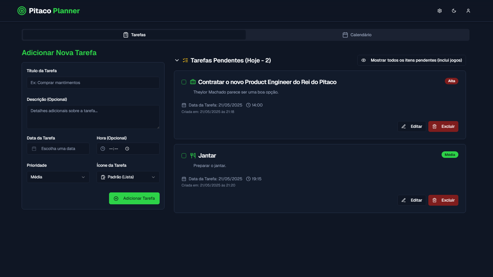
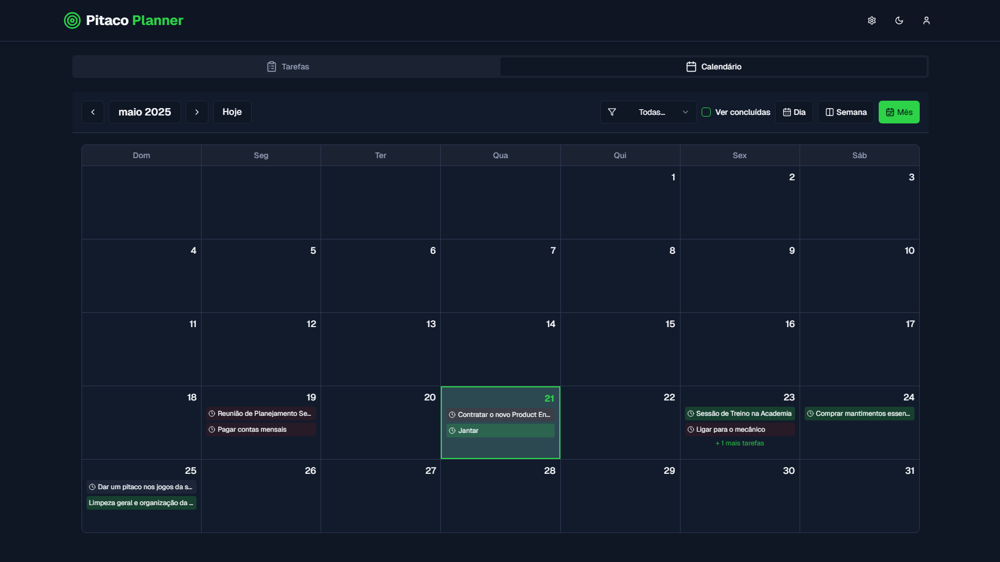
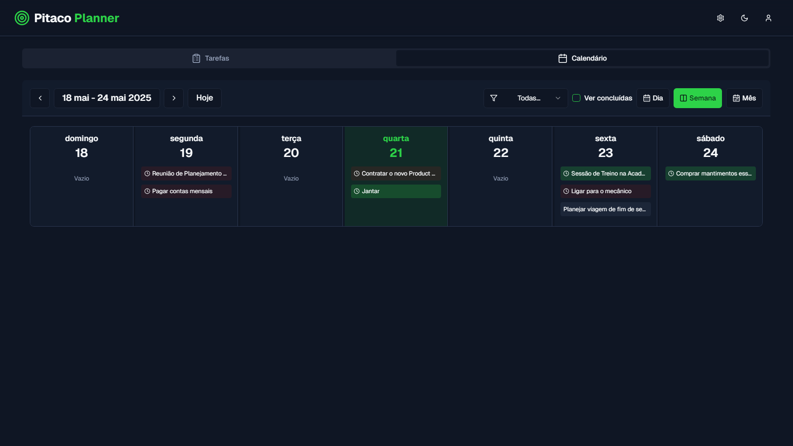

# Pitaco Planner

Pitaco Planner é um organizador de tarefas pessoais com um toque esportivo, permitindo que você gerencie suas atividades diárias enquanto se mantém atualizado sobre os jogos da FURIA e outros times!

**[🎉 Veja o Pitaco Planner em Ação (Live Demo no Vercel)!](https://pitaco-planner.vercel.app)**

## Visão Geral do Aplicativo (Screenshots/Vídeos)

### Tela principal de tarefas


### Visualização do calendário mensal


### Visualização do calendário semanal


### Tela de edição de tarefas


**Funcionalidades demonstradas:**
*   Criação e gerenciamento de tarefas.
*   Visualização em calendário (dia, semana, mês).
*   Destaques de jogos.
*   Botão "Dar Pitaco".
*   Modo Escuro.
*   Configurações de dados.

## Funcionalidades Detalhadas

- **Gerenciamento de Tarefas**:
    - Crie, edite, exclua e marque tarefas como concluídas.
    - As tarefas são salvas localmente no seu navegador (`localStorage`).
    - Adicione data e hora (opcional) para cada tarefa.
    - Selecione um ícone personalizado para cada tarefa.
    - Defina prioridades (Alta, Média, Baixa).
    - Filtre a lista de tarefas para mostrar apenas as de hoje ou todas as pendentes (incluindo jogos).
    - Seções de "Tarefas Pendentes" e "Tarefas Concluídas" minimizáveis.
- **Visualização em Calendário**:
    - Visualize suas tarefas e os jogos (ex: FURIA, América-RN) em visualizações de dia, semana (padrão) e mês.
    - Navegue facilmente entre períodos (dia/semana/mês anterior/próximo e "Hoje").
    - Filtre tarefas exibidas no calendário por prioridade.
    - Opção para mostrar/ocultar tarefas concluídas no calendário.
    - Destaque visual para o dia atual.
    - Destaque para eventos (tarefas/jogos) ao serem selecionados, levando à visualização diária.
- **Destaques de Jogos**:
    - Veja os próximos jogos de times selecionados (ex: FURIA CS2, América-RN Futebol) diretamente no calendário.
    - Jogos com links de aposta têm destaque visual (cor e ícone).
- **Botão "Dar Pitaco"**:
    - Em dias de jogos da FURIA CS2 ou América Futebol Clube, um botão direciona para o [Rei do Pitaco](https://reidopitaco.bet.br/betting) para dar palpites.
- **Modo Escuro**:
    - Alterne entre temas claro e escuro para melhor conforto visual.
- **Configurações de Dados**:
    - Menu de configurações com as seguintes opções (com diálogo de confirmação para ações destrutivas):
        - Adicionar Tarefas de Exemplo: Popula a semana atual com tarefas pré-definidas.
        - Resetar (Limpar tarefas, manter jogos): Remove todas as tarefas do usuário e restaura a lista de jogos padrão.
        - Limpar Tudo (Tarefas e Jogos): Remove permanentemente todas as tarefas e jogos do calendário.
- **Responsividade**:
    - Design adaptado para desktop e mobile.

## Design e Estilo

O Pitaco Planner adota um estilo esportivo e moderno:
- **Cores**: Paleta baseada em tons escuros (azul marinho profundo ou cinza escuro no modo escuro), com o verde vibrante característico do Rei do Pitaco como cor primária e um amarelo/dourado como cor de destaque para eventos com aposta.
- **Tipografia**:
    - Fontes sans-serif modernas e fortes para títulos (`Geist Sans`).
    - Fontes limpas e legíveis para o corpo do texto e código (`Geist Sans`, `Geist Mono`).
- **Iconografia**: Ícones com tema esportivo e relacionados a produtividade, fornecidos pela biblioteca `lucide-react`.
- **Componentes UI**: Utilização de componentes `ShadCN/UI`, customizados para seguir a identidade visual do projeto.
- **Contraste**: Atenção ao contraste de texto, especialmente no modo claro.

## Stack Tecnológica e Bibliotecas

O Pitaco Planner é construído com as seguintes tecnologias e bibliotecas principais:

- **Next.JS (v15+ com App Router)**: Framework React para desenvolvimento full-stack, utilizado pela sua performance, roteamento baseado em arquivos e Server Components (embora este projeto seja majoritariamente client-side devido ao `localStorage`).
- **React (v18+)**: Biblioteca JavaScript para construção de interfaces de usuário.
- **TypeScript**: Superset do JavaScript que adiciona tipagem estática, melhorando a robustez e manutenibilidade do código.
- **Tailwind CSS**: Framework CSS utility-first para estilização rápida e responsiva. Configurado para usar variáveis CSS para theming.
- **ShadCN/UI**: Coleção de componentes de UI reutilizáveis, acessíveis e customizáveis, construídos sobre Radix UI e Tailwind CSS.
- **Lucide Icons**: Biblioteca de ícones SVG, oferecendo uma vasta gama de ícones limpos e consistentes.
- **date-fns**: Biblioteca moderna para manipulação de datas e horas, utilizada para formatação, cálculos e navegação no calendário.
- **localStorage**: API do navegador utilizada para persistir os dados das tarefas localmente.
- **Framer Motion**: Biblioteca para animações fluidas, utilizada para transições suaves em elementos da UI, como o colapso das listas de tarefas.
- **Zod**: Biblioteca para validação de esquemas, utilizada para validar os dados do formulário de tarefas.
- **React Hook Form**: Biblioteca para gerenciamento de formulários em React, facilitando a validação e o manuseio de dados de entrada.

## Decisões Técnicas e Arquitetura

- **Estrutura do Projeto**: Organizado com o App Router do Next.js, separando componentes de UI (`components/ui`), componentes específicos da aplicação (`components/pitaco-planner`), hooks customizados (`hooks`), e lógica de negócios/tipos/mocks (`lib`).
- **Gerenciamento de Estado**:
    - O estado global das tarefas é gerenciado pelo hook customizado `useTasks`, que encapsula a lógica de CRUD e a persistência em `localStorage`.
    - O estado da UI (como a aba ativa, data selecionada no calendário, visibilidade de modais) é gerenciado localmente nos componentes relevantes usando `useState` e `useCallback`.
- **Componentização**: A UI é construída com uma abordagem de componentes reutilizáveis. Os componentes `ShadCN/UI` são usados como base, e componentes customizados são criados para funcionalidades específicas do Pitaco Planner.
- **Estilização**: Tailwind CSS é a principal ferramenta de estilização, com variáveis CSS definidas em `src/app/globals.css` para o sistema de temas (claro/escuro). Isso permite uma fácil customização das cores base do ShadCN/UI.
- **Persistência de Dados**: As tarefas dos usuários são salvas no `localStorage` do navegador, tornando a aplicação funcional offline após o primeiro carregamento e mantendo os dados entre sessões sem a necessidade de um backend. Os dados de jogos são mockados e carregados estaticamente.
- **Responsividade**: O layout é construído com Tailwind CSS, utilizando suas classes responsivas para adaptar a interface a diferentes tamanhos de tela.

## Uso de Inteligência Artificial no Desenvolvimento

Este projeto utilizou ferramentas de Inteligência Artificial para auxiliar no processo de desenvolvimento:

- **Firebase Studio**:
    - **Geração de Código e Interface**: Grande parte da estrutura inicial dos componentes de UI, a lógica de gerenciamento de estado inicial e a implementação de funcionalidades foram geradas ou significativamente assistidas por esta ferramenta. Isso acelerou o desenvolvimento, permitindo focar na integração e nos requisitos específicos do Pitaco Planner.
    - **Refatoração e Correção de Erros**: A IA foi utilizada para identificar e corrigir erros de runtime, otimizar trechos de código e refatorar componentes para melhor clareza e performance.
    - **Implementação de Novas Funcionalidades**: Solicitações de novas features, como o sistema de abas, a lógica do calendário e os filtros, foram frequentemente iniciadas com o auxílio da IA para gerar o boilerplate e a lógica base.

- **Google Gemini Diffusion (Demo)**:
    - **Estruturação de Ideias**: Utilizado na fase inicial para brainstorming de funcionalidades, organização da estrutura do projeto e definição dos requisitos da aplicação.
    - **Seleção de Bibliotecas**: Auxiliou na pesquisa e escolha de bibliotecas adequadas para necessidades específicas, como manipulação de datas (`date-fns`) e animações (`framer-motion`).

O uso dessas ferramentas de IA permitiu um ciclo de desenvolvimento mais rápido, ajudando a prototipar e iterar sobre as funcionalidades de forma eficiente.

## Ideias para desenvolvimento futuro

Se eu tivesse mais tempo, teria integrado uma API para atualizar automaticamente o calendário com os jogos dos times escolhidos, além de implementar login, criação automática de tarefas recorrentes (mensais, semanais, etc.) e um sistema de notificações para lembrar o usuário das tarefas mais importantes do dia a dia.

## Como Rodar o Projeto Localmente

Siga os passos abaixo para configurar e rodar o Pitaco Planner localmente:

### Pré-requisitos

- **Node.js**: Versão 18.x ou superior. Você pode baixar em [nodejs.org](https://nodejs.org/).
- **npm** ou **yarn**: Gerenciador de pacotes Node.js. npm vem com Node.js; yarn pode ser instalado separadamente.
- **Git**: Para clonar o repositório. Você pode baixar em [git-scm.com](https://git-scm.com/).

### Instalação

1.  **Clone o repositório** (se ainda não o fez):
    ```bash
    git clone https://github.com/theylor999/pitaco-planner
    cd pitaco-planner
    ```

2.  **Instale as dependências:**
    Usando npm:
    ```bash
    npm install
    ```
    Ou usando yarn:
    ```bash
    yarn install
    ```

### Rodando a Aplicação em Modo de Desenvolvimento

1.  **Inicie o servidor de desenvolvimento Next.js:**
    Usando npm:
    ```bash
    npm run dev
    ```
    Ou usando yarn:
    ```bash
    yarn dev
    ```
    Por padrão, a aplicação estará disponível em `http://localhost:9002` (conforme script `dev` no `package.json`).

2.  Abra seu navegador e acesse `http://localhost:9002`.

**Demonstração Pública:** Este projeto foi implantado no Vercel e pode ser acessado publicamente em: **[https://pitaco-planner.vercel.app](https://pitaco-planner.vercel.app)**

## Estrutura do Projeto (Principais Pastas)

```
pitaco-planner/
├── imgs/                     # Imagens de demonstração
├── public/                   # Arquivos estáticos
├── src/
│   ├── app/                  # Rotas e layout principal do Next.js App Router
│   │   ├── globals.css       # Estilos globais e tema Tailwind/ShadCN
│   │   ├── layout.tsx        # Layout raiz da aplicação
│   │   └── page.tsx          # Página principal do Pitaco Planner
│   ├── components/
│   │   ├── pitaco-planner/   # Componentes específicos do Pitaco Planner
│   │   └── ui/               # Componentes ShadCN/UI (geralmente adicionados via CLI)
│   ├── hooks/                # Hooks customizados (ex: useTasks, useTheme, useMobile)
│   ├── lib/                  # Utilitários, tipos, dados mockados, ícones, etc.
│   └── ...
├── .env                      # Variáveis de ambiente (atualmente vazio)
├── next.config.ts            # Configurações do Next.js
├── package.json
├── tailwind.config.ts        # Configurações do Tailwind CSS
└── tsconfig.json             # Configurações do TypeScript
```
